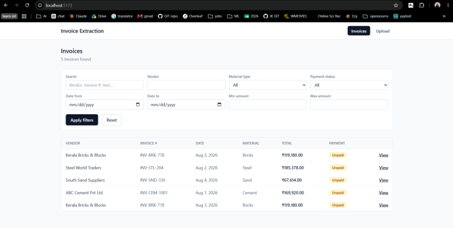
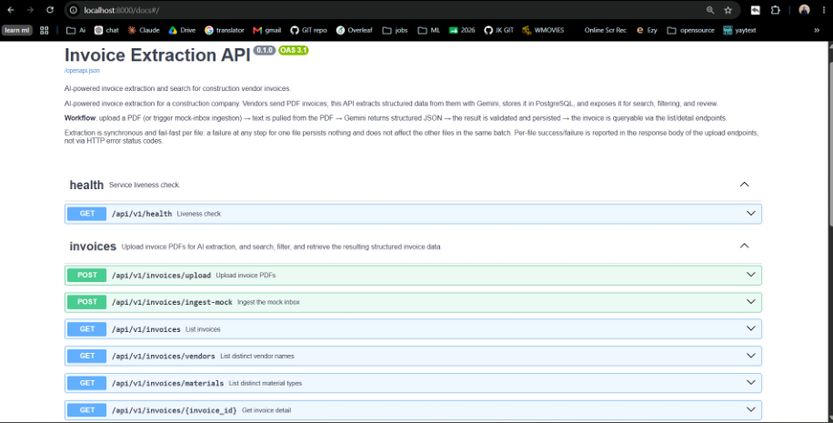

# AI-Powered Invoice Extraction System

Automates extraction of structured data (vendor, invoice number, line items, totals, GST)
from construction-vendor invoice PDFs using Gemini structured output, and stores it in
PostgreSQL behind a FastAPI REST API with a React frontend.

See [CLAUDE.md](./CLAUDE.md) for architecture, folder structure, and conventions.

## How it works

1. A PDF is uploaded (or picked up from the mock inbox, simulating an incoming vendor
   email).
2. Text is pulled out with `pdfplumber`, falling back to `PyMuPDF` if the primary
   extractor finds no text layer.
3. The extracted text is sent to Gemini with a `response_schema`, so the model returns
   validated structured JSON directly — no free-form prompting or manual parsing.
4. The result is validated and persisted (invoice + line items) in PostgreSQL.
5. Processing is synchronous and fail-fast per file: if any step fails, nothing is
   written for that file and the failure is reported back per-file, without affecting
   the rest of the batch. See "Deliberate simplifications" in
   [CLAUDE.md](./CLAUDE.md#deliberate-simplifications-read-before-improving-these) for
   why this is a scope decision rather than a gap.

## Screenshots

**Invoice list** — filters, search, and pagination over extracted invoices:



**Swagger docs** — full OpenAPI schema at `/docs`:



## Prerequisites

- Docker + Docker Compose
- A Gemini API key (https://aistudio.google.com/apikey)

## Setup

1. Copy the env template and fill in your Gemini API key (and change the default
   Postgres password if this will run anywhere beyond your own machine):

   ```bash
   cp .env.example .env
   ```

2. Start the stack:

   ```bash
   docker compose up --build
   ```

3. Apply database migrations (first run, or after model changes):

   ```bash
   docker compose exec backend alembic upgrade head
   ```

4. Services:
   - Frontend: http://localhost:5173
   - Backend API: http://localhost:8000
   - Swagger docs: http://localhost:8000/docs
   - Postgres: localhost:5432

## Using it

- **Upload page** — drag/select one or more PDF invoices and upload them. Each file's
  result (success or failure) is shown individually.
- **Invoice list page** — browse all extracted invoices with filters (vendor, material
  type, payment status, date range, amount range), free-text search, and pagination.
- **Invoice detail page** — full extracted detail for one invoice: line items, totals,
  the raw text pulled from the PDF, and the full structured JSON Gemini returned.

To try it without sourcing your own PDFs, drop files in `backend/mock_inbox/` (a few
samples are already there) and call `POST /invoices/ingest-mock` from Swagger — it
processes every PDF in that folder with the same per-file success/failure semantics as
a normal upload.

## Environment variables

Set in `.env` (copied from `.env.example`), loaded via Pydantic `Settings` in
`backend/app/config.py`:

| Variable | Purpose |
|---|---|
| `POSTGRES_USER` / `POSTGRES_PASSWORD` / `POSTGRES_DB` | Postgres container credentials/database |
| `DATABASE_URL` | SQLAlchemy connection string used by the backend |
| `GEMINI_API_KEY` | Gemini API key |
| `GEMINI_MODEL` | Gemini model name (default `gemini-2.5-flash`) |
| `APP_ENV` | `development` / `production` |
| `LOG_LEVEL` | Python logging level |
| `CORS_ORIGINS` | Comma-separated origins allowed to call the API |
| `UPLOAD_DIR` | Where uploaded PDFs are stored |
| `MAX_UPLOAD_SIZE_MB` | Per-file upload size limit |
| `MOCK_INBOX_DIR` | Folder scanned by `/invoices/ingest-mock` |
| `VITE_API_BASE_URL` | API base URL the frontend calls |

## Running tests

```bash
docker compose exec backend pytest
```

Covers:
- `test_pdf_service.py` — unit tests for the pdfplumber/PyMuPDF extraction fallback chain
- `test_ai_extraction_service.py` — unit tests for the Gemini extraction service (mocked client)
- `test_invoices_upload_api.py` — integration tests for the upload/ingest endpoints (success + failure cases)
- `test_invoices_list_api.py` — integration tests for list/filter/search/pagination and the detail endpoint

Integration tests run against the same Postgres instance as local dev (no separate
test database). Each test runs inside a transaction that's rolled back afterwards, so
none of it touches your real data permanently.

## Project status

See the development plan in [CLAUDE.md](./CLAUDE.md#development-plan--status) for what's
implemented. Core flow (upload → extraction → storage → API → frontend) is
complete and tested.
